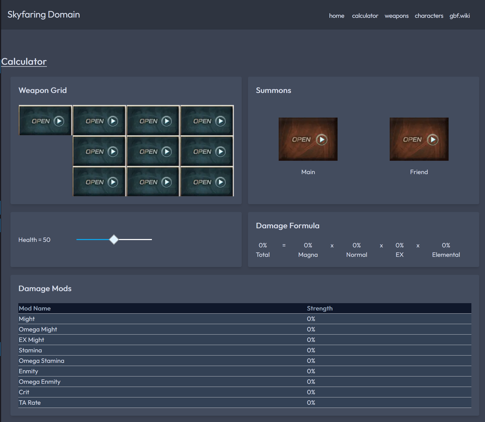

    

<h1 align="center">
  GBF Damage Calculator Website
</h1>

  A website for GBF to calculate the damage formula. Useful for those to plan what resources to invest in!

  <a href="">
    Link to website here! (LINK NOT IMPLEMENTED YET)
  </a>

## Features
- Search for weapons in the game
- Calculator that determines mod strength for weapons that a player doesn't own
- Responsive Design with mobile-first mindset

## Issues?
If there are any issues, please [raise an issue](https://github.com/miiwo/granblue_front/issues) on the project page, and I'll look into it!

## Screenshots

## License
MIT

